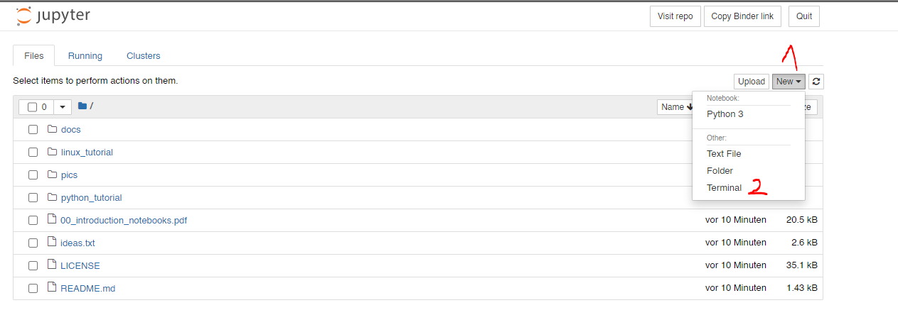

# Linux tutorial

Linux is an open-source operating system, first released in 1991. Linux is what's running on virtually all supercomputers and cluster all over the world. Linux is very modular and comes often as the underlying software of so-called distributions. Such distributions are the popular Ubuntu/Debian Family, of the commercial Red Hat Enterprise Linux distribution. The most significant difference between Windows and Linux for new users is the usage text-only commands. Instead of opening applications or settings pages and working your way through it with a mouse, you just open a terminal and type away.

## Background info: Shell, Terminal, Console

Skip this part if you don't care for the terminology of these words.

- **Terminal**: A device file, that allows command execution beyond read and write. Terminals are provided by the kernal on behalf of a hardware device (keyboard key presses are presented on screen and output can also be printed). Often Terminal emulators are provided through an extra layer to the kernel. Such emulators are: ssh, screen, tmux and the graphical applications that allow you to type into a window and execute commands.
- **Console**: A physical device with which commands will be sent to a computer (teletype writers in shorthand tty). The console appears to the computer as a kernel-implemented terminal. Most linux machines come with multiple consoles (ttys), from which one is used to run graphical applications.
- **Command line**: An interface where a user types commands.
- **Shell**: A shell is the interface that users see, when they log in. The shell is what starts other programs and defines the syntax with which programs are started. Because these *commands* are entered to the shell in Linux, the command-line can also be referred to as a command-line-shell.

## Opening a terminal on binder

The easiest way to start your first terminal is to head over to binder and select New and the Terminal.

https://mybinder.org/v2/gh/kevinsawade/start-science-here/HEAD



## The prompt

You are now greeted by the *prompt*. The *prompt* looks like this:

```bash
jovyan@jupyter-kevinsawade-2dstart-2dscience-2dhere-2dd2sbp0zb:~$
```

This somewhat unusual prompt comes from us using a terminal on a webpage (there are some obstacles associated when using a terminal completely portable on a browser). The *prompt* is normally built like this:

```bash
username@hostname:~$
```
The *prompt* contains useful information, such as your username, the name of the computer (`hostname`) and your current directory. The tilde symbol (~) shows you, that you are in your home directory. To make sure, that you are in your home directory you can print your current working environment by calling your first command. Sometimes the dollar sign ($) is prefixed to commands that you should execute on a linux shell to prevent any confusions with other programs / shells.

The other command prompts are listed below:

- `$`: Linux shells in general, `bash` in particular.
- `>>>`: Python
- `>`: Windows command prompt or windows power shell
- `%`: Tcl

But that's enough of that. Now we want to make sure we are in our home directory. Enter this command (without the dollar sign), hit the enter key and observe the output:

```bash
$ pwd
/home/jovyan
```

Success! You are in your home directory. We can continue with our Linux Tutorial.


Try and change the directory to your Downloads directory with the ```cd``` command. Commands which are to be entered into the console are often prepended with a dollar sign ($):

```bash
$ cd Downloads
```

The *prompt* will change and display the following:

```bash
username@computername:~/Downloads$
```

To change back to your home directory you can "climb up" the directory tree once with the ```cd``` command. Enter:

```bash
$ cd ..
```

You can do more awesome stuff in the terminal. If you want to learn more you can visit the linux tutorial **AFTER** completing the step "working with jupyter notebooks"

## Check if git is installed

The files are hosted on github. Github is a service by Microsoft which allows to collaborate on through the internet on software development. We use the program *git* to track changes, control versions of programs, and upload these changes to github.com. To download projects from github.com the program *git* needs to be installed on your computer. Let us check if the program is installed. Open a terminal and enter the following command:

```bash
$ whereis git
```

If this returns something like this:

```bash
git: /usr/bin/git /usr/share/man/man1/git.1.gz
```

You are all set and can continue. If this command returns something like this:

```bash
git:
```

*git* is not installed on your computer. Please ask someone to help you installing *git*

## Download the files

To avoid clutter it is advised to download this tutorial into a directory that is not the home directory (~). Let's create a new directory four all our *git* downloads.

```bash
$ mkdir git
$ cd git
```

In this directory we can donwload the tutorial files with:

```bash
$ git clone THIS NEEDS TO BE CHANGED WHEN THE TUTORIAL HAS BEEN PUSHED TO GITHUB.COM
```

## Working with jupyter notebooks

The next part of this tutorial can be found in a html file. To open it enter:

```bash
$ cd ~/git/tutorial_new_members
$ firefox 00_introduction_notebooks.html &
```